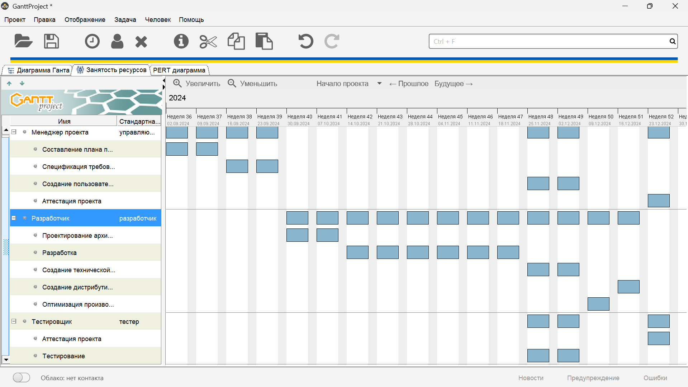
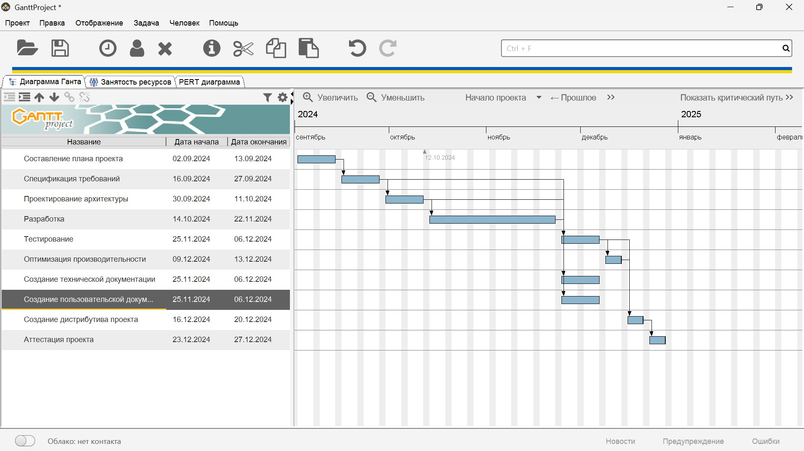
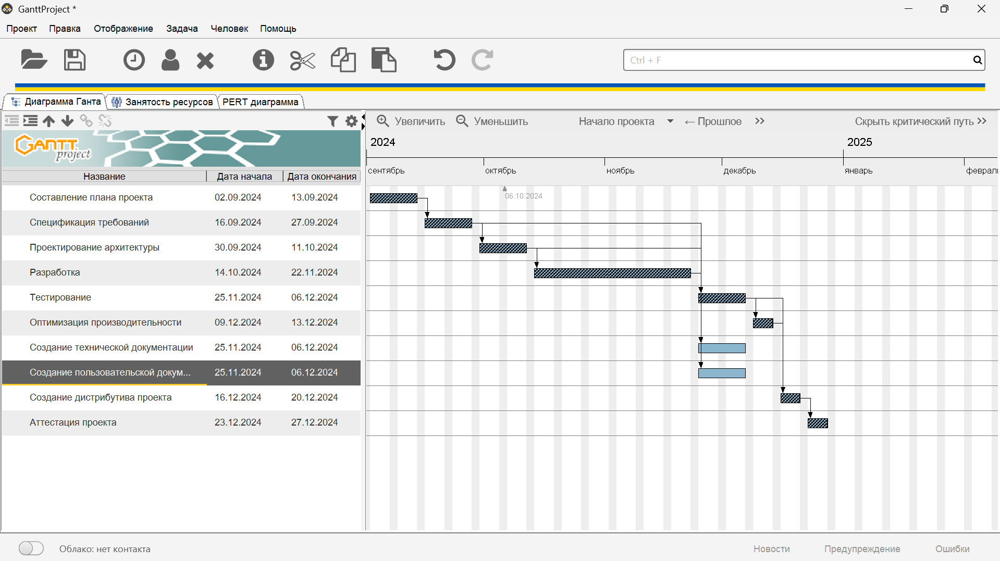
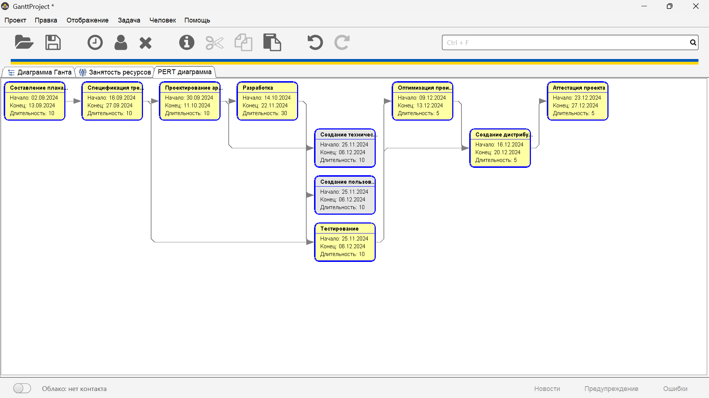

# Отчет "Планирование"

## План проекта
1.	Составление плана проекта.
2.	Спецификация требований.
3.	Проектирование архитектуры.
4.	Разработка.
5.	Оптимизация производительности.
6.	Тестирование.
7.	Создание технической документации.
8.	Создание пользовательской документации.
9.	Создание дистрибутива проекта.
10.	Аттестация проекта.

## Распределение ресурсов

## Диаграмма Гантта
### Диаграмма

### Критический путь

## Диаграмма Перта

